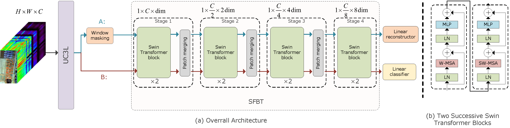

# SwinMSP: A Shifted Windows Masked Spectral Pretraining Model for Hyperspectral Image Classification

[[Paper]](https://ieeexplore.ieee.org/document/10606196)


The repository contains the implementation of the paper "SwinMSP: A Shifted Windows Masked Spectral Pretraining Model for Hyperspectral Image Classification"




## Installation


```bash
pip install -r requirements.txt
```

You may install torch and torchvision manually.
    
```bash
torch==1.12.0
torchvision==0.13.0
```

## Usage


Paste .mat file and .pth file in `hsi_data/` and `output/swin_msp_pt/` respectively. you can download from the following links:

| Dataset |                                                        mat file                                                        | weights file |
|:--------|:----------------------------------------------------------------------------------------------------------------------:|:------------:|
| PaviaU  | [PaviaU.mat](https://drive.google.com/file/d/1aWLZnbIXdDzpj1ZUxGcKGoK2gC3N10NH/view?usp=sharing)<br/>[PaviaU_gt.mat](https://drive.google.com/file/d/1X1RzNB21zV8UzKbMs2gFJbdE5t0LJeIK/view?usp=sharing) | [download](https://drive.google.com/file/d/1RAYmspdx0x6op_PRf3XC6s8yzShluyCf/view?usp=drive_link) |


### Fine-tune

##### For PaviUniversity Dataset:

Specify the weight file path in the `--pretrained` parameter, such as `output/swin_msp_pt/PaviaU/ckpt_epoch_499.pth`:

```bash
python swin_msp_ft.py --cfg configs/finetune/swin_msp_ft_pu.yaml --pretrained output/swin_msp_pt/PaviaU/ckpt_epoch_499.pth --runs 10
```

The results will be saved in the `cls_result` directory. The class map will be saved in the `cls_map` directory. 
The running log will be saved in the `log` directory. The weights will be saved in the `output` directory.

### Pre-train

##### For PaviUniversity Dataset:

```bash
python swin_msp_pt.py --cfg configs/pretrain/swin_mae_pt_pu.yaml --tag swin_msp_pt_pu
```

## Citation


```bibtex
@ARTICLE{10606196,
  author={Tian, Rui and Liu, Danqing and Bai, Yu and Jin, Yu and Wan, Guanliang and Guo, Yanhui},
  journal={IEEE Transactions on Geoscience and Remote Sensing}, 
  title={Swin-MSP: A Shifted Windows Masked Spectral Pretraining Model for Hyperspectral Image Classification}, 
  year={2024},
  volume={62},
  number={},
  pages={1-14},
  keywords={Hyperspectral imaging;Task analysis;Feature extraction;Image classification;Computer architecture;Computational modeling;Long short term memory;Hyperspectral image (HSI) classification;pretraining model;Swin-MAE;transformer},
  doi={10.1109/TGRS.2024.3431517}}

```

## Acknowledgement

----

[DeepHyperX](https://github.com/xiachangxue/DeepHyperX), [Swin-Transformer](https://github.com/microsoft/Swin-Transformer), 
[Swin-MAE](https://github.com/Zian-Xu/Swin-MAE), [SpectralFormer](https://github.com/danfenghong/IEEE_TGRS_SpectralFormer), 
[MAEST](https://github.com/ibanezfd/MAEST), [morphFormer](https://github.com/mhaut/morphFormer)
